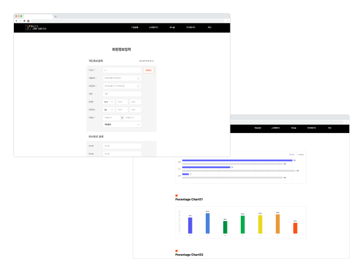
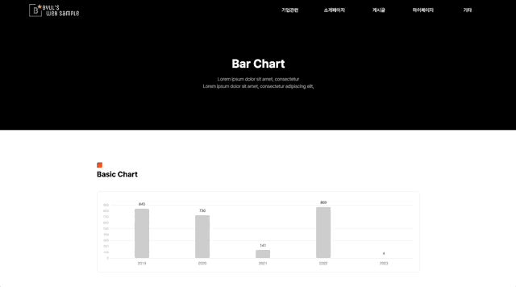
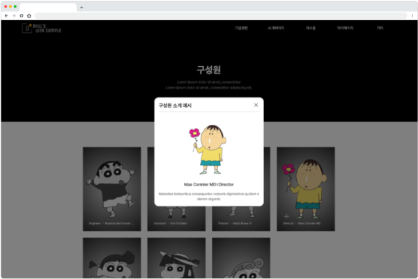
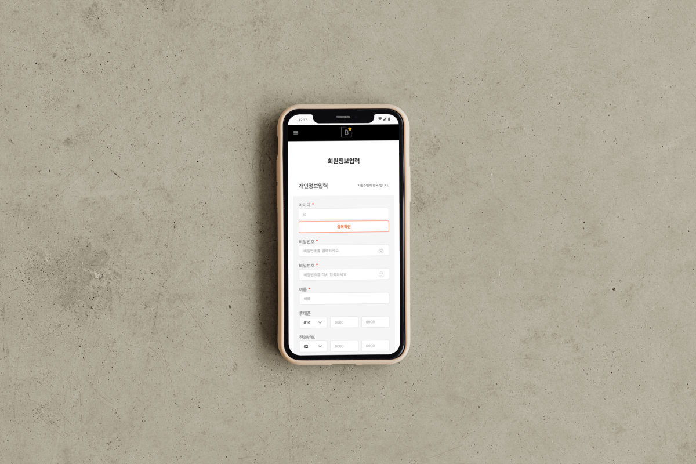

# Web Sample
 

 
 
<a display="block" href="#">https://byul-web-sample.netlify.app</a>
  

 

## 화면구성 🖥

 

## Stacks 🧑🏻‍💻
### Environment

### Config
        
### Development
 

![Recoil](https://img.shields.io/badge/recoil-3578e5?style=for-the-badge&logo=data:image/svg+xml;base64,PHN2ZyB4bWxucz0iaHR0cDovL3d3dy53My5vcmcvMjAwMC9zdmciIHdpZHRoPSI2MDAiIGhlaWdodD0iNjAwIiB2aWV3Qm94PSIwIDAgNjAwIDYwMCI+PGxpbmsgeG1sbnM9IiIgdHlwZT0idGV4dC9jc3MiIGlkPSJkYXJrLW1vZGUiIHJlbD0ic3R5bGVzaGVldCIgaHJlZj0iIi8+PGcgZmlsbD0id2hpdGUiPjxwYXRoIGQ9Ik0xNDIuNTM2IDE5OC44NThjMCAyNi4zNi0yMS4zNjggNDcuNzItNDcuNzIgNDcuNzItMjYuMzYgMC00Ny43MjItMjEuMzYtNDcuNzIyLTQ3LjcyczIxLjM2LTQ3LjcyIDQ3LjcyLTQ3LjcyYzI2LjM1NSAwIDQ3LjcyMiAyMS4zNiA0Ny43MjIgNDcuNzIiLz48cGF0aCBkPSJNNTA1LjE4IDQxNC4yMjVIMjM4LjEyNGMtMzUuMjUgMC02My45MjYtMjguNjc0LTYzLjkyNi02My45MjNzMjguNjc4LTYzLjkyNiA2My45MjYtNjMuOTI2aDEyMC43OGMyMC44MTYgMCAzNy43NTMtMTYuOTM4IDM3Ljc1My0zNy43NTZzLTE2LjkzOC0zNy43NTYtMzcuNzUzLTM3Ljc1Nkg5NC44MWMtNy4yMjcgMC0xMy4wODYtNS44Ni0xMy4wODYtMTMuMDg1IDAtNy4yMjcgNS44Ni0xMy4wODYgMTMuMDg1LTEzLjA4NmgyNjQuMDkzYzM1LjI1IDAgNjMuOTIzIDI4LjY3OCA2My45MjMgNjMuOTI2cy0yOC42NzQgNjMuOTIzLTYzLjkyMyA2My45MjNoLTEyMC43OGMtMjAuODIgMC0zNy43NTYgMTYuOTM4LTM3Ljc1NiAzNy43NiAwIDIwLjgxNiAxNi45MzggMzcuNzUzIDM3Ljc1NiAzNy43NTNINTA1LjE4YzcuMjI3IDAgMTMuMDg2IDUuODYgMTMuMDg2IDEzLjA4NSAwIDcuMjI2LTUuODU4IDEzLjA4NS0xMy4wODUgMTMuMDg1eiIvPjxwYXRoIGQ9Ik00NTcuNDY0IDQwMS4xNDJjMC0yNi4zNiAyMS4zNi00Ny43MiA0Ny43Mi00Ny43MnM0Ny43MiAyMS4zNiA0Ny43MiA0Ny43Mi0yMS4zNiA0Ny43Mi00Ny43MiA0Ny43Mi00Ny43Mi0yMS4zNi00Ny43Mi00Ny43MiIvPjwvZz48c3R5bGUgeG1sbnM9IiIgaWQ9ImRhcmstbW9kZS1jdXN0b20tY29sb3IiPgoJCTpyb290ewoJCQktLWJnLWNvbG9yOnJnYmEoMjYsMjYsMjYsMSk7CgkJCS0tdGV4dC1jb2xvcjpyZ2JhKDExMCwxMTAsMTEwLDEpOwoJCQktLWEtY29sb3I6cmdiYSg5MCwxMjAsMTIwLDEpOwoJCQktLWEtdmlzaXRlZC1jb2xvcjpyZ2JhKDEyMCwxMjAsOTAsMSk7CgkJCS0tYS1ob3Zlci1jb2xvcjpyZ2JhKDIxMSwyMTEsMjExLDEpOwoJCQktLWlucHV0LWJvcmRlci1jb2xvcjpyZ2JhKDIxMSwyMTEsMjExLDAuMik7CgkJCS0taW5wdXQtcGxhY2Vob2xkZXItY29sb3I6cmdiYSgxNzMsMjE2LDIzMCwxKTsKCQkJLS1kaWFsb2ctYmctY29sb3I6cmdiYSgzNiwzNiwzNiwwLjk1KTsKCQkJLS1iZy1pbWFnZTpsaW5lYXItZ3JhZGllbnQocmdiYSgyNiwyNiwyNiwxKSxyZ2JhKDI2LDI2LDI2LDEpKTsKCQl9Cgk8L3N0eWxlPjwvc3ZnPg==)

### Style
 

### Configuration Management & Deploy

    
 

## Project Detail 💻
### 1. 직접만든 React Reference 및 Component 정리
- 추후에 타 프로젝트 진행시 해당 프로젝트에서 손쉽게 Reference 및 Component를 가지고가서 사용하기 위해 만든 프로젝트.

 

### 2. Faker JS 사용
- 데이터가 필요한 부분에 대해서는 Faker JS를 사용하여 Mock데이터 연동.

 

### 3. 모바일 디바이스 대응
- 반응형작업을 통해 모바일 디바이스 사이즈 대응.

 
